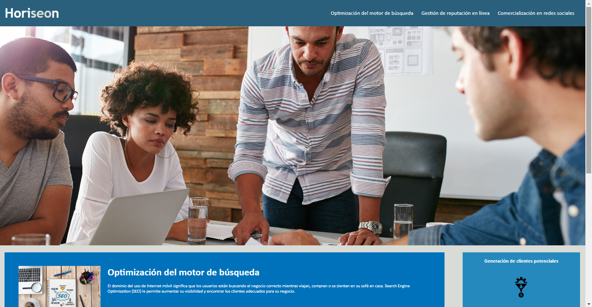
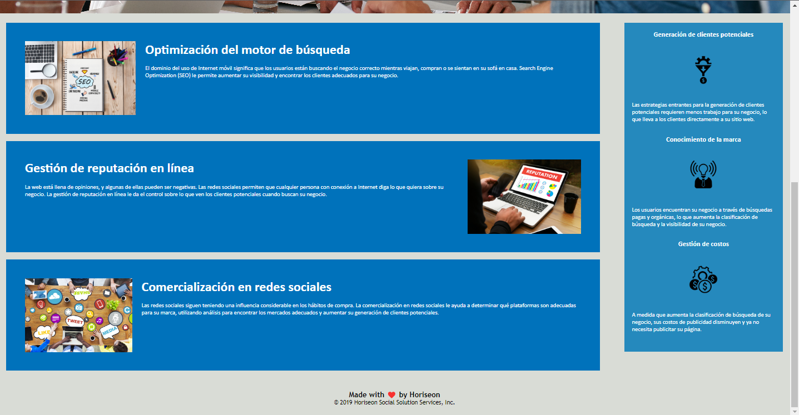

# challengeFirstModule 🐛  
Repositorio correspondiente al Desafío del Módulo 1. 

# Aplicación web de Horiseon 🏆
Sitio web de Horiseon que permite consultar tres apartados diferentes: 
* Optimización del motor de búsqueda
* Gestión de reputación en línea. 
* Comercialización en redes sociales. 

--

Así como el aside, permite saber más acerca de:
* Generación de clientes potenciales 
* Conocimiento de la marca. 
* Gestión de costos. 

--
## Características aplicación web 💡
* El sitio web cumple con la accesibilidad requerida para ser usuarios con requerimientos especiales de uso. 
* Las siguientes imágenes demuestran la apariencia de la aplicación web:

## Acceso a aplicación web
* A través del siguiente enlace se puede acceder a la aplicación web.
[Liga para aplicación web](https://carlosgortiz.github.io/challengeFirstModule/)
* [Liga del repositorio del proyecto web.](https://github.com/carlosgortiz/challengeFirstModule)